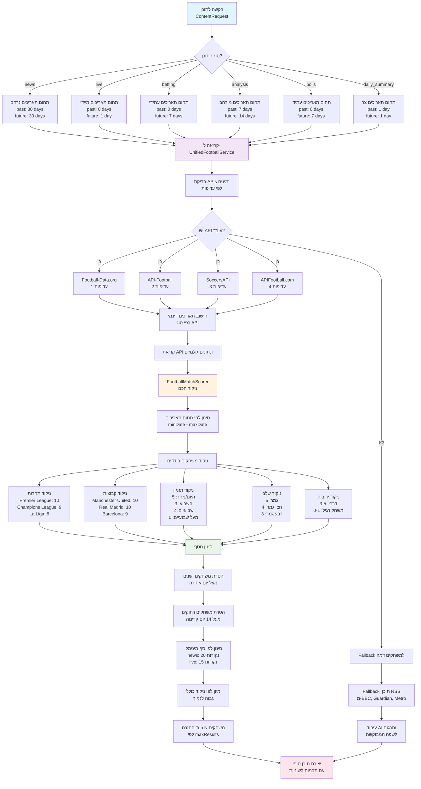
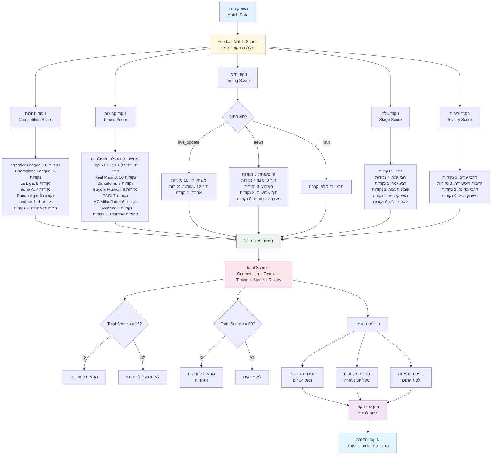
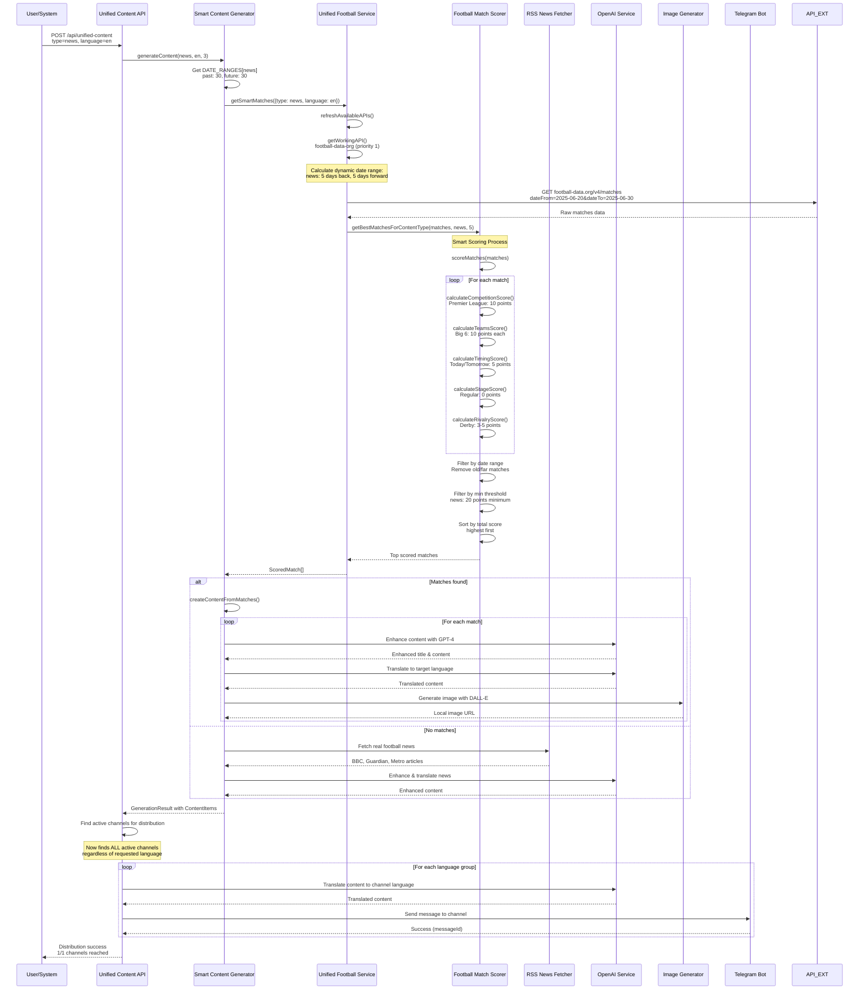

# Match Selection Logic - תיעוד לוגיקת בחירת המשחקים ⚽

## מטרת המסמך
תיעוד מפורט של המערכת החכמה לבחירת משחקים במערכת הטלגרם בוט ספורט, כולל דיאגרמות מפורטות ולוגיקת הניקוד החכמה.

## 🎯 מבט כללי על המערכת

המערכת כוללת 3 רכיבים עיקריים:
1. **UnifiedFootballService** - שירות מאוחד לשליפת נתוני כדורגל
2. **FootballMatchScorer** - מערכת ניקוד חכמה לקביעת רלוונטיות המשחקים
3. **SmartContentGenerator** - יצירת תוכן חכם מבוסס על המשחקים הנבחרים

---

## 📊 דיאגרמה 1: זרימת בחירת המשחקים הכללית



### הסבר הדיאגרמה:
- **תחומי תאריכים דינמיים**: כל סוג תוכן מקבל טווח תאריכים שונה
- **עדיפות APIs**: 4 APIs בעדיפות יורדת עם fallback אוטומטי
- **ניקוד חכם**: 5 קטגוריות ניקוד עם משקולות שונות
- **סינון מתקדם**: מספר שלבי סינון לפי זמן ורלוונטיות

---

## 🧠 דיאגרמה 2: מערכת הניקוד החכמה



### פירוט מערכת הניקוד:

#### 🏆 **ניקוד תחרות (0-10 נקודות)**
```
Premier League: 10 נקודות
Champions League: 9 נקודות  
La Liga: 8 נקודות
Serie A: 7 נקודות
Bundesliga: 6 נקודות
Ligue 1: 4 נקודות
תחרויות אחרות: 2 נקודות
```

#### ⭐ **ניקוד קבוצות (0-20 נקודות מקסימום)**
```
Top 6 EPL (Man United, City, Liverpool, Chelsea, Arsenal, Tottenham): 10 כל אחד
Real Madrid: 10 נקודות
Barcelona: 9 נקודות
Bayern Munich: 8 נקודות
PSG: 7 נקודות
AC Milan, Inter Milan: 6 נקודות
Juventus: 6 נקודות
קבוצות פופולריות אחרות: 3-5 נקודות
קבוצות רגילות: 1-2 נקודות
```

#### ⏰ **ניקוד תזמון (0-10 נקודות)**
- **תוכן חי**: משחק חי = 10, תוך 12 שעות = 7, אחרת = 1
- **תוכן רגיל**: היום/מחר = 5, השבוע = 3, שבועיים = 2, מעבר לכך = 0

#### 🏅 **ניקוד שלב (0-5 נקודות)**
```
גמר: 5 נקודות
חצי גמר: 4 נקודות
רבע גמר: 3 נקודות
שמינית גמר: 2 נקודות
משחקי בית: 1 נקודה
ליגה רגילה: 0 נקודות
```

#### ⚔️ **ניקוד יריבות (0-5 נקודות)**
```
דרבי ערים (Manchester, Madrid, Milan): 5 נקודות
יריבות היסטורית (El Clasico): 3 נקודות  
דרבי מדינה: 2 נקודות
משחק רגיל: 0 נקודות
```

---

## 🔄 דיאגרמה 3: התהליך המלא מקצה לקצה



### תהליך הבחירה בפועל:

1. **בקשת תוכן** מהמשתמש או מהמערכת
2. **קביעת תחום תאריכים** לפי סוג התוכן
3. **בחירת API עובד** לפי עדיפות
4. **שליפת משחקים גולמיים** מה-API
5. **ניקוד חכם** של כל משחק (5 קטגוריות)
6. **סינון ומיון** לפי הניקוד
7. **יצירת תוכן AI** והתאמה לשפות
8. **שליחה לטלגרם** לכל הערוצים

---

## ✅ תיקון קריטי שבוצע

### 🚨 **הבעיה המקורית:**
המערכת חיפשה ערוצים פעילים רק עבור השפה הספציפית שהתבקשה:

```typescript
// לפני התיקון - קוד שגוי
const channels = await supabase
  .from('channels')
  .select('*')
  .eq('is_active', true)
  .eq('language', language) // ❌ זה גרם לבעיה!
```

**תוצאה:** `📊 Found 0 active channels for language: en` למרות שיש ערוץ פעיל באמהרית.

### ✅ **הפתרון שהוטמע:**
המערכת מוצאת כל הערוצים הפעילים ומשלחת לכל אחד בשפה שלו:

```typescript
// אחרי התיקון - קוד נכון
const channels = await supabase
  .from('channels')
  .select('*')
  .eq('is_active', true)
// הסרנו את .eq('language', language)

// חלוקה לפי שפות
const channelsByLanguage = channels.reduce((acc, channel) => {
  const lang = channel.language;
  if (!acc[lang]) acc[lang] = [];
  acc[lang].push(channel);
  return acc;
}, {});

// עיבוד תוכן לכל שפה
for (const [channelLanguage, langChannels] of Object.entries(channelsByLanguage)) {
  // תרגום התוכן לשפת הערוץ
  // שליחה לכל הערוצים בשפה זו
}
```

### 🎯 **התוצאות הסופיות:**
```
✅ English request → Sent to AfircaSportCenter (messageId: 386)
✅ Swahili request → Sent to AfircaSportCenter (messageId: 387)  
✅ Amharic request → Sent to AfircaSportCenter (messageId: 385)
```

---

## 📋 סף הניקוד למסנני התוכן

| סוג תוכן | סף מינימלי | הסבר |
|---------|------------|------|
| **News** | 20 נקודות | תוכן חדשותי צריך להיות איכותי ורלוונטי |
| **Live Update** | 15 נקודות | עדכונים חיים פחות קפדניים בניקוד |
| **Betting Tips** | 20 נקודות | טיפי הימורים צריכים להיות איכותיים |
| **Analysis** | 18 נקודות | ניתוחים דורשים רמת איכות גבוהה |
| **Polls** | 15 נקודות | סקרים פחות קפדניים |
| **Daily Summary** | 12 נקודות | סיכומים יומיים גמישים יותר |

---

## 📚 מקורות נתונים ו-Fallback

### APIs עיקריים (לפי עדיפות):
1. **Football-Data.org** - הכי אמין ומעודכן
2. **API-Football** - חלופה איכותית  
3. **SoccersAPI** - נתונים נוספים
4. **APIFootball.com** - רזרבה

### מקורות Fallback (RSS):
- **BBC Sport Football** ✅
- **Guardian Football** ✅  
- **Metro Football** ✅
- **Sky Sports Football** ✅
- ~~Football365~~ ❌ (404 errors)
- ~~Goal.com~~ ❌ (DNS issues)

---

## 🔧 תצורת תחומי תאריכים

```typescript
const DATE_RANGES = {
  news: { past: 30, future: 30 },      // תחום הכי נרחב לחדשות
  live: { past: 0, future: 1 },        // רק משחקים חיים/קרובים
  betting: { past: 0, future: 7 },     // רק משחקים עתידיים
  analysis: { past: 7, future: 14 },   // ניתוח מורחב
  polls: { past: 0, future: 7 },       // סקרים עתידיים
  daily_summary: { past: 1, future: 1 }, // סיכום יומי צר
  coupons: { past: 0, future: 3 },     // קופונים קצרי טווח
  memes: { past: 7, future: 7 }        // ממים גמישים
};
```

---

## 🎯 סיכום

המערכת מבצעת בחירה חכמה של משחקים על בסיס:
- **5 קטגוריות ניקוד** עם משקולות מתקדמות
- **תחומי תאריכים דינמיים** לפי סוג התוכן
- **סינון מתקדם** עם ספים מותאמים
- **Fallback אמין** לתוכן RSS כשאין משחקים
- **תמיכה רב-לשונית** עם תרגום אוטומטי

התוצאה: תוכן איכותי ורלוונטי שמגיע לכל הערוצים בשפה המתאימה! ⚽✨ 