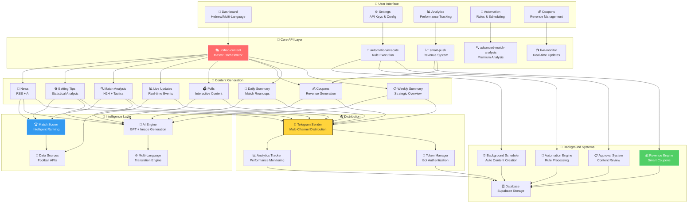

# 🗺️ מפה כוללת של המערכת - Telegram Bot Management System

## 🎯 תיאור כללי
מערכת מקיפה לניהול בוטים של טלגרם המתמחה בתוכן ספורט עם מערכת הכנסות אוטומטית מתקדמת.

## 🏗️ ארכיטקטורה כללית

## 🎯 מרכיבי המערכת

### 👤 **User Interface Layer**
- **Dashboard**: ממשק ראשי רב-לשוני
- **Settings**: ניהול API Keys וקונפיגורציה
- **Analytics**: מעקב ביצועים
- **Automation**: כללי אוטומציה וזמנים
- **Coupons**: ניהול הכנסות

### 🚀 **Core API Layer** 
- **unified-content**: מנגנון מרכזי לכל התוכן
- **automation/execute**: ביצוע כללי אוטומציה
- **smart-push**: מערכת הכנסות חכמה
- **advanced-match-analysis**: ניתוחים מתקדמים
- **live-monitor**: עדכונים בזמן אמת

### 🎨 **Content Generation**
8 סוגי תוכן שונים:
1. **News** - חדשות מ-RSS + AI
2. **Betting Tips** - ניתוחים סטטיסטיים
3. **Match Analysis** - ניתוח H2H וטקטיקות
4. **Live Updates** - אירועים בזמן אמת
5. **Polls** - תוכן אינטראקטיבי
6. **Coupons** - הכנסות
7. **Daily Summary** - סיכומים יומיים
8. **Weekly Summary** - סיכומים שבועיים

### 🧠 **Intelligence Layer**
- **Match Scorer**: דירוג חכם של משחקים
- **AI Engine**: GPT + יצירת תמונות
- **Data Sources**: מספר APIs של כדורגל
- **Multi-Language**: תרגום ולוקליזציה

### 🔧 **Background Systems**
- **Background Scheduler**: יצירת תוכן אוטומטי
- **Automation Engine**: עיבוד כללים
- **Approval System**: אישור תוכן
- **Revenue Engine**: קופונים חכמים
- **Database**: אחסון Supabase

### 📤 **Distribution**
- **Telegram Sender**: שליחה רב-ערוצית
- **Analytics Tracker**: מעקב ביצועים
- **Token Manager**: אימות בוטים

## 📊 **סטטוס נוכחי**
- ✅ **פעיל**: 90% מהמערכת
- ⚠️ **בעיות**: BettingTipsGenerator, unified-content API
- 🔧 **בתיקון**: טבלאות חסרות, Dashboard Stats
- 🚀 **מוכן לפריסה**: מערכת הכנסות מלאה

## 🎯 **הערות חשובות**
- המערכת מיועדת לתוכן ספורט בעיקר כדורגל
- תמיכה ב-3 שפות: עברית, אמהרית, סווהילי
- מערכת הכנסות אוטומטית מלאה
- מוכנה לפריסה מסחרית 