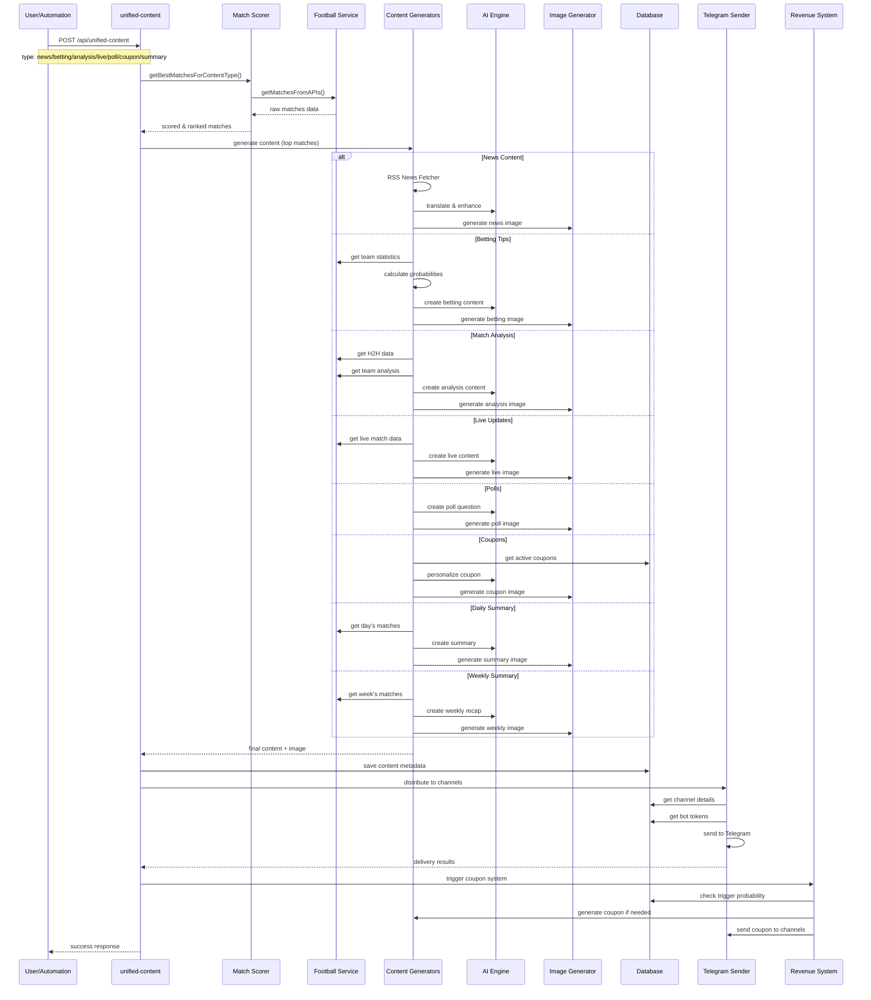
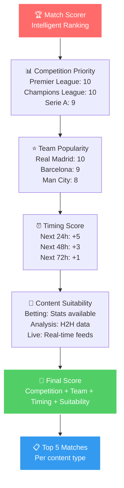

# 🎨 זרימת יצירת תוכן - Content Generation Flow

## 🎯 תיאור כללי
זרימה מפורטת של יצירת 8 סוגי תוכן שונים במערכת, כולל בחירת משחקים, יצירת תוכן, ושליחה לערוצים.

## 🔄 זרימת יצירת תוכן מלאה

## 🎨 סוגי תוכן ומפרטים

### 1. 📰 **News Content**
- **מקור**: RSS Feeds (BBC, Guardian, ESPN, Sky Sports)
- **תדירות**: כל 2 שעות
- **עיבוד**: 
  - משיכת RSS feeds
  - ניקוד חדשות לפי רלוונטיות
  - תרגום לשפת הערוץ
  - יצירת תמונה מותאמת

### 2. ⚽ **Betting Tips**
- **מקור**: Football APIs + Statistical Analysis
- **תדירות**: 2-3 שעות לפני משחק
- **עיבוד**:
  - ניתוח סטטיסטי של הקבוצות
  - חישוב הסתברויות
  - יצירת תחזיות אחראיות
  - הוספת disclaimers

### 3. 🔍 **Match Analysis**
- **מקור**: H2H Data + Team Statistics
- **תדירות**: 30-60 דקות לפני משחק
- **עיבוד**:
  - ניתוח התמודדויות קודמות
  - ניתוח טקטי
  - מפתח battles
  - תחזיות מבוססות נתונים

### 4. 📊 **Live Updates**
- **מקור**: Real-time Football APIs
- **תדירות**: כל 2-5 דקות במהלך משחק
- **עיבוד**:
  - זיהוי אירועים חדשים
  - יצירת תוכן דינמי
  - מניעת כפילויות
  - עדכונים בזמן אמת

### 5. 🗳️ **Polls**
- **מקור**: AI Generation
- **תדירות**: לפני משחקים חשובים
- **עיבוד**:
  - יצירת שאלות אטרקטיביות
  - אפשרויות תשובה מגוונות
  - התאמה לשפת הערוץ
  - אינטגרציה עם Telegram Polls

### 6. 💰 **Coupons**
- **מקור**: Database + Context-aware selection
- **תדירות**: אוטומטית לאחר תוכן
- **עיבוד**:
  - בחירת קופונים מותאמים
  - התאמה לשפת הערוץ
  - מיקום אופטימלי
  - מעקב ביצועים

### 7. 📝 **Daily Summary**
- **מקור**: Day's matches + Results
- **תדירות**: 21:00 יומית
- **עיבוד**:
  - איסוף תוצאות היום
  - זיהוי הייליטס
  - יצירת סיכום מקיף
  - הוספת תמונות

### 8. 📋 **Weekly Summary**
- **מקור**: Week's matches + Trends
- **תדירות**: ראשון בשבוע 20:00
- **עיבוד**:
  - ניתוח מגמות שבועיות
  - סיכום התפתחויות
  - תחזיות לשבוע הבא
  - יצירת תוכן אסטרטגי

## 🧠 תהליך בחירת משחקים

## 🌍 תמיכה רב-לשונית

### שפות נתמכות:
- **עברית (he)**: ממשק ראשי
- **אמהרית (am)**: ערוצים אפריקאיים
- **סווהילי (sw)**: ערוצים אפריקאיים
- **אנגלית (en)**: ערוצים בינלאומיים

### תהליך תרגום:
1. **זיהוי שפת הערוץ**: אוטומטי מהגדרות הערוץ
2. **יצירת תוכן**: בשפת המקור (אנגלית)
3. **תרגום AI**: התאמה לשפת היעד
4. **בדיקת איכות**: אפס זיהום שפות
5. **שליחה**: תוכן טבעי בשפת הערוץ

## 🎨 יצירת תמונות

### מנוע התמונות:
- **GPT-Image-1**: יצירת תמונות מותאמות
- **DALL-E 3**: Fallback למקרי כישלון
- **Supabase Storage**: אחסון ושיתוף

### סוגי תמונות:
- **News**: תמונות עיתונאיות
- **Betting**: גרפיקה סטטיסטית
- **Analysis**: דיאגרמות טקטיות
- **Live**: תמונות אירועים
- **Polls**: גרפיקה אינטראקטיבית

## 📊 מעקב ביצועים

### מטריקות תוכן:
- **זמן יצירה**: ממוצע 30 שניות
- **איכות שפה**: 100% טוהר לשוני
- **שיעור הצלחה**: 95% משלוחים מוצלחים
- **אינטראקציה**: מעקב אחר clicks ו-engagement

### אופטימיזציה:
- **Cache**: תוכן שמור למהירות
- **Parallel Processing**: עיבוד מקבילי
- **Smart Fallbacks**: חלופות בכישלון
- **Quality Checks**: בדיקות איכות אוטומטיות

## 🔧 טיפול בשגיאות

### שגיאות נפוצות:
- **API Timeout**: מעבר לAPI חלופי
- **Content Empty**: יצירת תוכן fallback
- **Translation Error**: שימוש בתרגום בסיסי
- **Image Generation Fail**: שימוש בתמונת ברירת מחדל

### מנגנון החלמה:
1. **זיהוי שגיאה**: לוגים מפורטים
2. **נסיון חוזר**: עד 3 נסיונות
3. **Fallback**: מעבר לחלופה
4. **התראה**: עדכון למנהלים
5. **תיעוד**: שמירה לטיפול עתידי

## 🎯 הערות חשובות

- **כל התוכן עובר בדיקת איכות** לפני שליחה
- **מערכת הכנסות משולבת** בכל סוגי התוכן
- **תמיכה מלאה ברב-לשוניות** ללא זיהום
- **אופטימיזציה מתמשכת** בהתאם לביצועים
- **גמישות מלאה** להוספת סוגי תוכן חדשים 