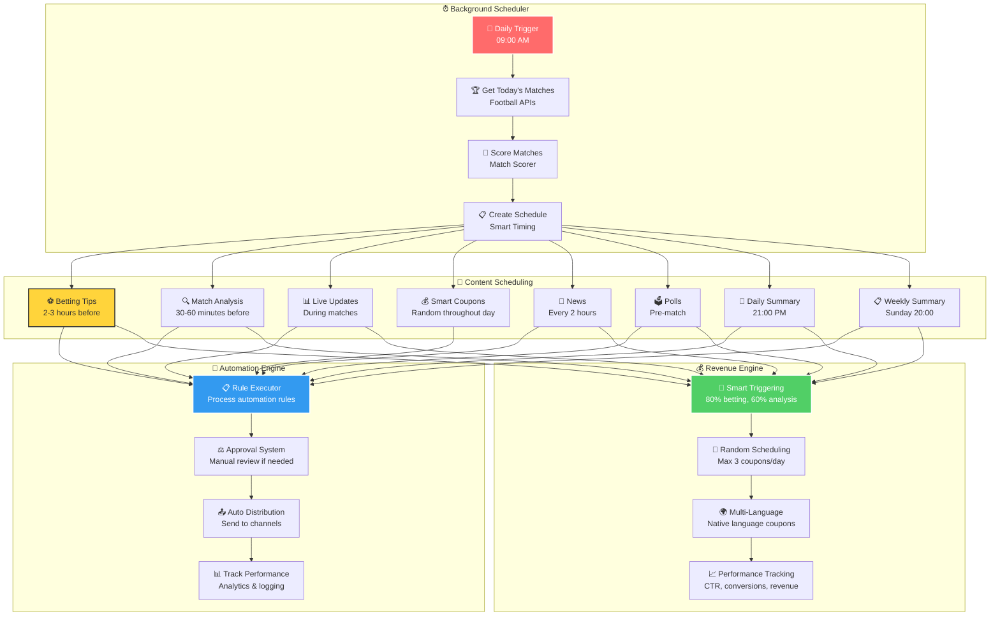
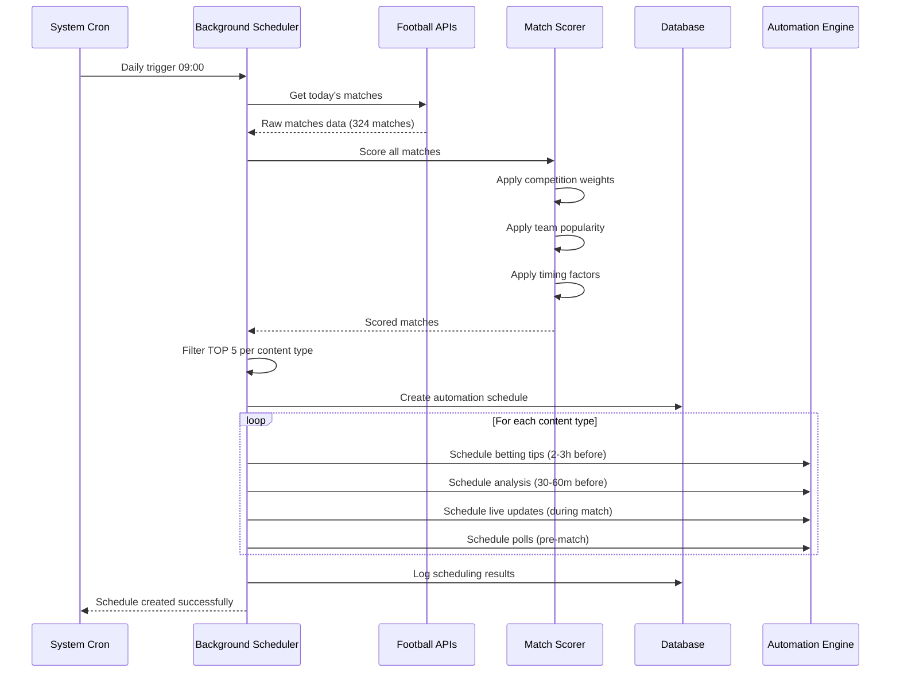
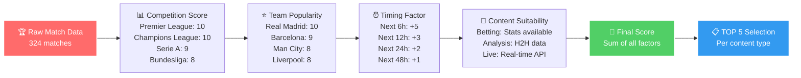
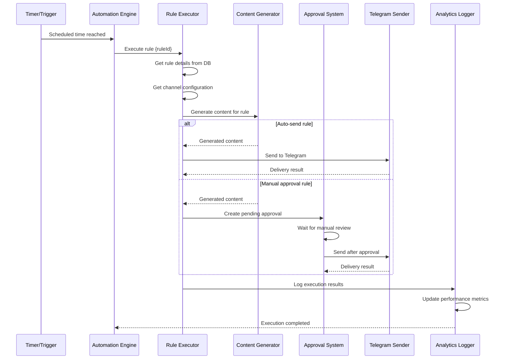
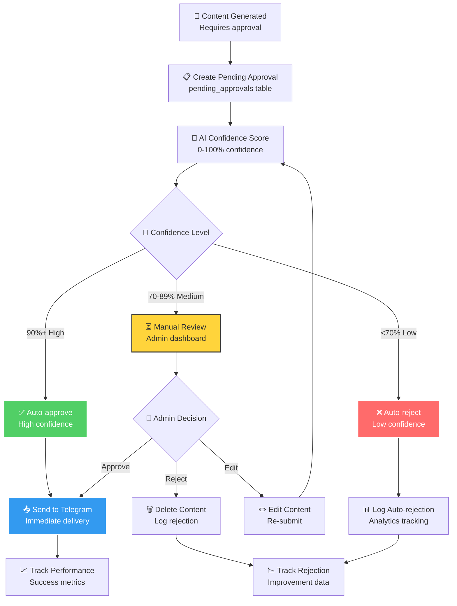
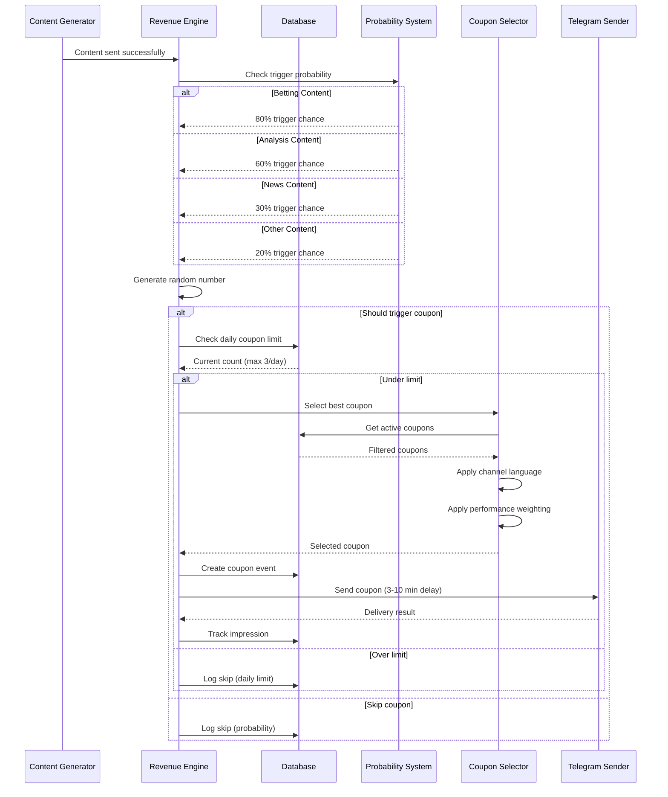
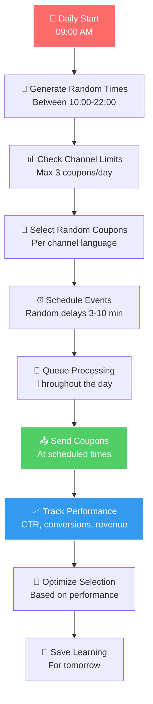
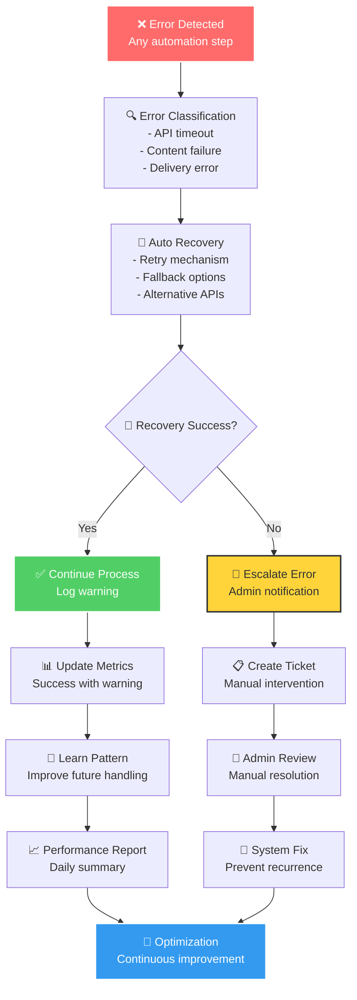

# 🤖 זרימת אוטומציה רקע - Background Automation Flow

## 🎯 תיאור כללי
מערכת אוטומציה מתקדמת שפועלת ברקע, מנהלת יצירת תוכן, זמנים, ואישורים באופן אוטומטי עם אינטליגנציה מלאכותית.

## 🕐 זרימת האוטומציה היומית

## 🧠 Smart Background Scheduler

### 🌅 **Daily Initialization (09:00 AM)**

### 🏆 **Match Scoring Algorithm**

## 🔄 Automation Engine

### 📋 **Rule Execution Process**

### ⚖️ **Approval System Workflow**

## 💰 Revenue Engine Integration

### 🎯 **Smart Coupon Triggering**

### 🎲 **Random Daily Scheduling**

## 📊 Performance Tracking & Analytics

### 📈 **Real-time Metrics**

```mermaid
graph LR
    A["`📊 Content Delivery<br/>Success/Failure`"] --> B["`📈 Performance Metrics<br/>- Delivery rate<br/>- Response time<br/>- Error rate`"]
    
    B --> C["`💰 Revenue Metrics<br/>- Coupon impressions<br/>- Click-through rate<br/>- Conversion rate`"]
    
    C --> D["`🎯 Engagement Metrics<br/>- User interactions<br/>- Channel growth<br/>- Content popularity`"]
    
    D --> E["`🧠 AI Optimization<br/>- Content scoring<br/>- Timing optimization<br/>- Channel preferences`"]
    
    E --> F["`🔄 Continuous Learning<br/>- Pattern recognition<br/>- Performance improvement<br/>- Adaptive scheduling`"]
    
    style A fill:#ff6b6b,stroke:#fff,stroke-width:2px,color:#fff
    style C fill:#51cf66,stroke:#fff,stroke-width:2px,color:#fff
    style E fill:#339af0,stroke:#fff,stroke-width:2px,color:#fff
    style F fill:#ffd43b,stroke:#333,stroke-width:2px,color:#333
```

### 🔍 **Error Handling & Recovery**

## 🎯 Content Type Scheduling

### ⚽ **Betting Tips Automation**
- **Timing**: 2-3 שעות לפני משחק
- **Selection**: TOP 5 משחקים מניקוד
- **Content**: ניתוח סטטיסטי + תחזיות
- **Revenue**: 80% הסתברות להפעלת קופון

### 🔍 **Match Analysis Automation**
- **Timing**: 30-60 דקות לפני משחק
- **Selection**: משחקים עם נתוני H2H
- **Content**: ניתוח מעמיק + טקטיקות
- **Revenue**: 60% הסתברות להפעלת קופון

### 📊 **Live Updates Automation**
- **Timing**: במהלך משחק (כל 2-5 דקות)
- **Selection**: משחקים פעילים מ-APIs
- **Content**: עדכונים בזמן אמת
- **Revenue**: 40% הסתברות להפעלת קופון

### 📰 **News Automation**
- **Timing**: כל 2 שעות
- **Selection**: RSS feeds + ניקוד רלוונטיות
- **Content**: חדשות מתורגמות
- **Revenue**: 30% הסתברות להפעלת קופון

## 🌍 Multi-Language Support

### 🗣️ **Language Detection**

```mermaid
graph LR
    A["`📺 Channel Configuration<br/>Language setting`"] --> B["`🔍 Auto-detect<br/>Channel language`"]
    
    B --> C["`📝 Content Generation<br/>Native language`"]
    
    C --> D["`💰 Coupon Selection<br/>Language-specific`"]
    
    D --> E["`📤 Delivery<br/>Pure language content`"]
    
    E --> F["`✅ Zero Contamination<br/>Quality assurance`"]
    
    style A fill:#ff6b6b,stroke:#fff,stroke-width:2px,color:#fff
    style C fill:#51cf66,stroke:#fff,stroke-width:2px,color:#fff
    style E fill:#339af0,stroke:#fff,stroke-width:2px,color:#fff
    style F fill:#ffd43b,stroke:#333,stroke-width:2px,color:#333
```

## 📋 **APIs בשימוש**

### 🔗 **Automation APIs**
- **`/api/automation/execute`**: ביצוע כלל אוטומציה
- **`/api/automation/background-scheduler`**: מתזמן רקע חכם
- **`/api/automation/approvals`**: מערכת אישורים
- **`/api/automation/full-automation-status`**: מעקב סטטוס

### 💰 **Revenue APIs**
- **`/api/smart-push/trigger`**: הפעלת קופונים חכמה
- **`/api/smart-push/schedule`**: תזמון קופונים יומי
- **`/api/smart-push/status`**: מעקב ביצועי הכנסות

### 📊 **Analytics APIs**
- **`/api/dashboard/stats`**: סטטיסטיקות מערכת
- **`/api/dashboard/health`**: בריאות מערכת
- **`/api/super-admin/stats`**: נתונים מתקדמים

## 🎯 הערות חשובות

- **מערכת האוטומציה פועלת 24/7** ללא התערבות אנושית
- **אינטליגנציה מלאכותית** מבוססת נתונים לאופטימיזציה
- **מערכת הכנסות אוטומטית** מלאה ומשולבת
- **תמיכה מלאה ברב-לשוניות** ללא זיהום
- **מעקב וניתוח ביצועים** בזמן אמת
- **מנגנון החלמה אוטומטי** מכל כישלון 