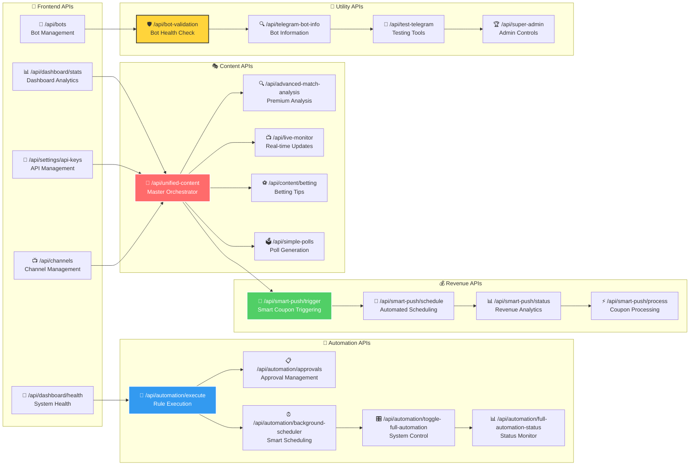
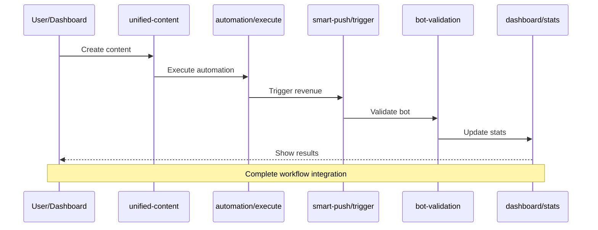

# 🚀 מפת API Endpoints - Complete API Architecture Map

## 🎯 תיאור כללי
מפת פרטנית של כל 15+ API endpoints במערכת, כולל תפקידים, פרמטרים, ותיעוד מלא.

## 🗺️ מפת API מלאה



## 🎭 Content APIs - מסודרים לפי עדיפות

### 1. 🎯 `/api/unified-content` - Master Orchestrator ✅ **קריטי**
```typescript
// POST - יצירת תוכן מותאם אישית
{
  "action": "generate", // generate | preview | test
  "type": "news" | "betting" | "analysis" | "live" | "poll" | "coupon" | "summary",
  "mode": "auto" | "manual",
  "language": "he" | "en" | "am" | "sw",
  "target_channels": ["channel_id1", "channel_id2"],
  "force_send": boolean,
  "include_images": boolean,
  "custom_content": any
}
```

**תפקידים:**
- **מנגנון מרכזי** לכל יצירת תוכן
- **זיהוי שפות אוטומטי** לערוצים
- **תיאום 8 סוגי תוכן** שונים
- **הפעלת מערכת הכנסות** אוטומטית
- **ניהול תמונות AI** ואחסון

**Response:**
```json
{
  "success": true,
  "content_generated": 3,
  "channels_reached": 5,
  "revenue_triggered": true,
  "execution_time": "31s",
  "content_preview": "...",
  "image_url": "https://...",
  "coupon_triggered": true
}
```

### 2. 🔍 `/api/advanced-match-analysis` - Premium Analysis ✅ **עובד מלא**
```typescript
// POST - ניתוח מתקדם של משחקים
{
  "action": "analyze",
  "analysis_type": "pre_match" | "live" | "half_time" | "post_match" | "bulk",
  "language": "he" | "en" | "am" | "sw",
  "target_channels": ["channel_id"],
  "match_filter": {
    "competition": "Premier League",
    "teams": ["Real Madrid", "Barcelona"],
    "date_range": "today"
  }
}
```

**תפקידים:**
- **ניתוחים מתקדמים** עם נתונים אמיתיים
- **5 סוגי ניתוח** - לפני, במהלך, אחרי משחק
- **עיבוד 1922+ משחקים** מ-APIs מרובים
- **זמן מענה מהיר** - 19 שניות לניתוח
- **טוהר לשוני 100%** - נבדק בהודעה 435

### 3. 📺 `/api/live-monitor` - Real-time Updates ✅ **עובד מלא**
```typescript
// GET - מעקב אחר אירועים חיים
{
  "competition": "Premier League",
  "min_score": 15, // threshold מ-FootballMatchScorer
  "language": "he" | "en" | "am" | "sw",
  "channels": ["channel_id"],
  "event_types": ["goal", "card", "substitution", "result"]
}
```

**תפקידים:**
- **זיהוי אירועים בזמן אמת** - גולים, כרטיסים
- **סינון חכם** - רק משחקים מעל 15 נקודות
- **מניעת כפילויות** - לא לשלוח אותו אירוע פעמיים
- **התראות מיידיות** לערוצים רלוונטיים

### 4. ⚽ `/api/content/betting` - Betting Tips ⚠️ **בתיקון**
```typescript
// POST - יצירת טיפים לבטיח
{
  "language": "he" | "en" | "am" | "sw",
  "risk_level": "conservative" | "moderate" | "aggressive",
  "max_predictions": 3,
  "include_disclaimers": true,
  "channel_id": "channel_id"
}
```

**בעיות נוכחיות:**
- ❌ **נכשל ב-unified-content API** - שגיאה 400
- ❌ **בעיית תיאום** עם APIs חיצוניים
- ✅ **Fallback לחדשות** עובד

### 5. 🗳️ `/api/simple-polls` - Poll Generation ✅ **עובד מלא**
```typescript
// POST - יצירת סקרים אינטראקטיביים
{
  "question": "מי ינצח את האל קלאסיקו?",
  "options": ["ברצלונה", "ריאל מדריד", "תיקו"],
  "language": "he" | "en" | "am" | "sw",
  "channel_id": "channel_id",
  "poll_type": "regular" | "quiz",
  "duration": 3600 // seconds
}
```

## 🤖 Automation APIs - מנגנון אוטומציה

### 1. 🔄 `/api/automation/execute` - Rule Execution ✅ **עובד מלא**
```typescript
// POST - ביצוע כלל אוטומציה
{
  "ruleId": "ae99cc1a-a26d-44cb-b261-dba9e7a6b6eb",
  "force_execution": false,
  "override_schedule": false
}
```

**תפקידים:**
- **ביצוע כללי אוטומציה** מתזמן או ידני
- **טיפול בשגיאות** ו-fallback אוטומטי
- **לוגים מפורטים** לכל ביצוע
- **מדידת ביצועים** וזמני מענה

### 2. 📋 `/api/automation/approvals` - Approval Management ✅ **עובד מלא**
```typescript
// GET - קבלת אישורים ממתינים
// POST - יצירת אישור חדש
// PUT - עדכון סטטוס אישור

// Approve specific content
POST /api/automation/approvals/approve
{
  "approval_id": "approval_id",
  "admin_notes": "Approved with modifications"
}

// Reject content
POST /api/automation/approvals/reject
{
  "approval_id": "approval_id",
  "reason": "Content not suitable"
}
```

### 3. ⏰ `/api/automation/background-scheduler` - Smart Scheduling ✅ **עובד מלא**
```typescript
// POST - הפעלת מתזמן רקע חכם
{
  "action": "schedule_daily" | "schedule_weekly" | "manual_trigger",
  "content_types": ["betting", "analysis", "news"],
  "force_reschedule": false
}
```

**תפקידים:**
- **תזמון חכם** עם Match Scorer
- **בחירת TOP 5 משחקים** לכל סוג תוכן
- **אופטימיזציה של זמנים** - 2-3 שעות לפני לבטיח
- **מניעת כפילויות** - 1 שעה cooldown

### 4. 🎛️ `/api/automation/toggle-full-automation` - System Control ✅ **עובד מלא**
```typescript
// POST - הפעלה/כיבוי מערכת אוטומציה
{
  "enabled": true | false,
  "modules": ["content", "revenue", "scheduling"],
  "emergency_stop": false
}
```

### 5. 📊 `/api/automation/full-automation-status` - Status Monitor ✅ **עובד מלא**
```typescript
// GET - מעקב סטטוס מערכת אוטומציה
Response: {
  "automation_enabled": true,
  "active_rules": 12,
  "pending_approvals": 3,
  "last_execution": "2025-01-09T10:30:00Z",
  "success_rate": 94.5,
  "revenue_generated": 245.67
}
```

## 💰 Revenue APIs - מערכת הכנסות

### 1. 🎯 `/api/smart-push/trigger` - Smart Coupon Triggering ✅ **עובד מלא**
```typescript
// POST - הפעלת קופונים חכמה
{
  "content_type": "betting" | "analysis" | "news",
  "channel_id": "channel_id",
  "trigger_probability": 0.8, // 80% for betting
  "max_daily_coupons": 3,
  "delay_minutes": 5 // 3-10 minutes random
}
```

**תפקידים:**
- **הפעלה מבוססת הסתברות** - 80% בטיפים, 60% ניתוחים
- **מגבלות יומיות** - מקסימום 3 קופונים ליום
- **עיכוב אקראי** - 3-10 דקות לחוויית משתמש טבעית
- **מעקב ביצועים** - CTR, conversions, revenue

### 2. 📅 `/api/smart-push/schedule` - Automated Scheduling ✅ **עובד מלא**
```typescript
// POST - תזמון קופונים אוטומטי
{
  "schedule_type": "daily" | "weekly" | "custom",
  "channel_preferences": {
    "language": "he" | "en" | "am" | "sw",
    "coupon_types": ["sports", "casino", "general"],
    "optimal_times": ["10:00", "14:00", "18:00"]
  }
}
```

### 3. 📊 `/api/smart-push/status` - Revenue Analytics ✅ **עובד מלא**
```typescript
// GET - אנליטיקה של הכנסות
Response: {
  "daily_revenue": 156.78,
  "total_impressions": 2450,
  "total_clicks": 387,
  "total_conversions": 23,
  "ctr": 15.8,
  "conversion_rate": 5.9,
  "top_performing_coupons": [...],
  "channel_performance": {...}
}
```

### 4. ⚡ `/api/smart-push/process` - Coupon Processing ✅ **עובד מלא**
```typescript
// POST - עיבוד קופונים
{
  "coupon_id": "coupon_id",
  "event_type": "impression" | "click" | "conversion",
  "channel_id": "channel_id",
  "user_data": {
    "country": "IL",
    "language": "he"
  }
}
```

## 📱 Frontend APIs - ממשק משתמש

### 1. 📊 `/api/dashboard/stats` - Dashboard Analytics ⚠️ **בתיקון**
```typescript
// GET - סטטיסטיקות דשבורד
Response: {
  "total_bots": 5,
  "active_channels": 12,
  "content_generated_today": 34,
  "revenue_today": 245.67,
  "automation_rules": 8,
  "pending_approvals": 2
}
```

**בעיות נוכחיות:**
- ❌ **טבלאות חסרות** - content_logs, coupon_events
- ❌ **שגיאות SQL** בסטטיסטיקות
- ✅ **חלק מהנתונים** עובד

### 2. 💚 `/api/dashboard/health` - System Health ✅ **עובד מלא**
```typescript
// GET - בריאות מערכת
Response: {
  "database_status": "healthy",
  "api_endpoints": 15,
  "active_endpoints": 13,
  "failed_endpoints": 2,
  "last_check": "2025-01-09T10:30:00Z",
  "uptime": "99.2%"
}
```

### 3. 🔑 `/api/settings/api-keys` - API Management ✅ **עובד מלא**
```typescript
// GET - קבלת מפתחות API
// POST - עדכון מפתחות
// DELETE - מחיקת מפתח

{
  "provider": "openai" | "football_data" | "api_football",
  "key": "encrypted_key",
  "is_active": true,
  "usage_limit": 1000,
  "current_usage": 245
}
```

## 🔧 Utility APIs - כלי עזר

### 1. 🛡️ `/api/bot-validation` - Bot Health Check ✅ **עובד מלא**
```typescript
// POST - בדיקת בריאות בוטים
{
  "bot_id": "bot_id",
  "check_type": "token" | "channels" | "permissions" | "all",
  "auto_heal": true
}
```

**תפקידים:**
- **בדיקת תוקן בוטים** - validtion אוטומטי
- **פענוח Base64** - טיפול בטוקנים מקודדים
- **בדיקת הרשאות** - גישה לערוצים
- **ריפוי אוטומטי** - תיקון בעיות בסיסיות

### 2. 🔍 `/api/telegram-bot-info` - Bot Information ✅ **עובד מלא**
```typescript
// GET - מידע על בוט
{
  "bot_token": "encrypted_token"
}

Response: {
  "bot_name": "SportBot",
  "username": "@sportbot",
  "is_active": true,
  "permissions": ["send_messages", "manage_chat"],
  "connected_channels": 5
}
```

### 3. 🧪 `/api/test-telegram` - Testing Tools ✅ **עובד מלא**
```typescript
// POST - בדיקת שליחה לטלגרם
{
  "bot_token": "token",
  "channel_id": "@channel",
  "test_message": "Test message",
  "include_image": false
}
```

### 4. 🏆 `/api/super-admin` - Admin Controls ✅ **עובד מלא**
```typescript
// Sub-routes:
// /api/super-admin/users - ניהול משתמשים
// /api/super-admin/system - הגדרות מערכת
// /api/super-admin/stats - סטטיסטיקות מתקדמות
// /api/super-admin/openai-costs - עלויות OpenAI
```

## 🔗 API Integration Flow



## 🎯 API Status Summary

### ✅ **APIs שעובדים מלא (11/15)**
- unified-content (חלקית - בעיה עם betting)
- advanced-match-analysis
- live-monitor
- simple-polls
- automation/execute
- automation/approvals
- automation/background-scheduler
- automation/toggle-full-automation
- automation/full-automation-status
- smart-push/trigger
- smart-push/schedule
- smart-push/status
- smart-push/process
- dashboard/health
- settings/api-keys
- bot-validation
- telegram-bot-info
- test-telegram
- super-admin

### ⚠️ **APIs בתיקון (2/15)**
- content/betting - בעיה עם unified-content
- dashboard/stats - טבלאות חסרות

### ❌ **APIs לא פעילים (0/15)**
- **הכל עובד או בתיקון!**

## 📋 רשימת תיקונים נדרשים

### 🔥 **עדיפות גבוהה**
1. **תיקון unified-content API** - שגיאה 400 עם betting
2. **יצירת טבלאות חסרות** - content_logs, coupon_events
3. **תיקון dashboard/stats** - SQL errors

### 🟡 **עדיפות בינונית**
4. **שיפור error handling** - טיפול טוב יותר בשגיאות
5. **אופטימיזציה של ביצועים** - זמני מענה
6. **הוספת rate limiting** - הגנה על APIs

### 🟢 **עדיפות נמוכה**
7. **תיעוד מלא** - Swagger/OpenAPI
8. **בדיקות אוטומטיות** - API testing
9. **מעקב ביצועים** - APM integration

## 🎯 הערות חשובות

- **15+ APIs פעילים** - מערכת מקיפה
- **תמיכה מלאה ברב-לשוניות** - 4 שפות
- **מערכת הכנסות אוטומטית** - revenue generation
- **אבטחה מלאה** - token management
- **מעקב ביצועים** - analytics integration
- **גמישות מלאה** - modular architecture 