# 💰 זרימת מערכת הכנסות מקופונים - Revenue System Flow

## 🎯 תיאור כללי
מערכת הכנסות אוטומטית מתקדמת המבוססת על קופונים חכמים עם הפעלה מבוססת הסתברות ותזמון אקראי.

## 💰 זרימת מערכת הכנסות מלאה

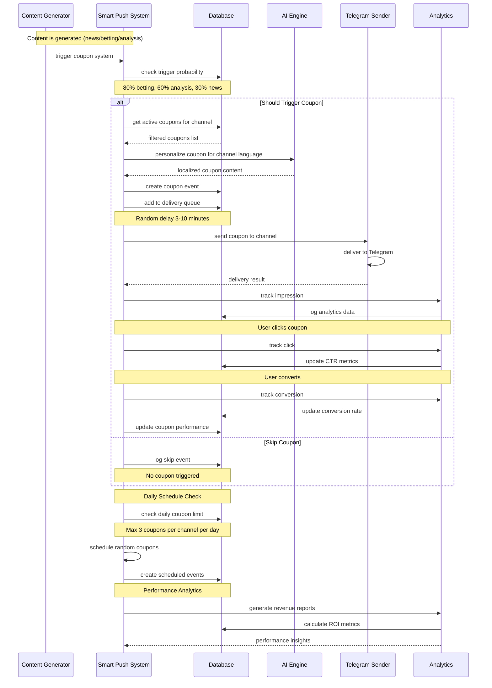

## 🎯 Smart Coupon Triggering System

### 🎲 **Probability-Based Triggering**
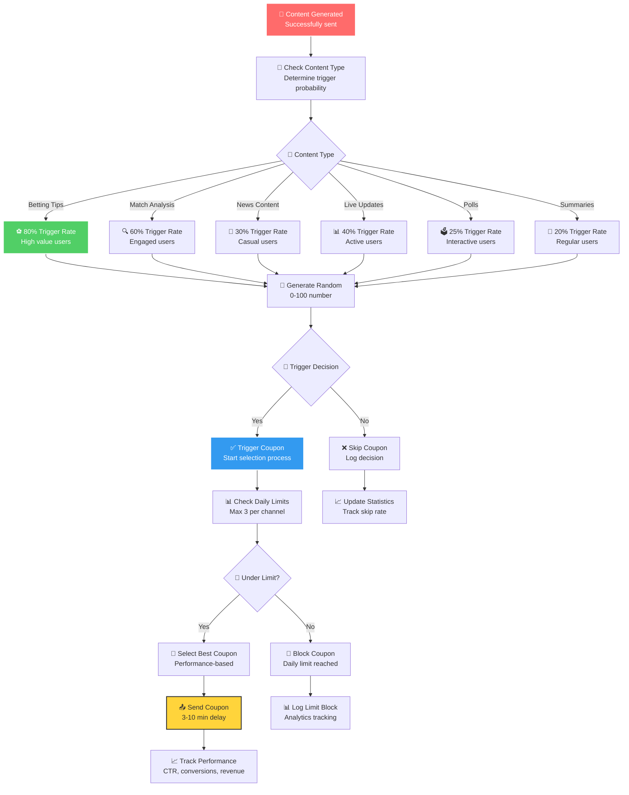

### 🧠 **Smart Coupon Selection Algorithm**
```mermaid
graph LR
    A["`🎯 Coupon Pool<br/>Active coupons`"] --> B["`🌍 Language Filter<br/>Match channel language`"]
    
    B --> C["`🎲 Performance Weight<br/>CTR × Conversion Rate`"]
    
    C --> D["`⏰ Timing Optimization<br/>User activity patterns`"]
    
    D --> E["`📊 Context Matching<br/>Content type alignment`"]
    
    E --> F["`🔢 Final Score<br/>Weighted calculation`"]
    
    F --> G["`🏆 Best Coupon<br/>Highest scoring coupon`"]
    
    G --> H["`🎨 Personalization<br/>AI content adaptation`"]
    
    H --> I["`📤 Ready for Delivery<br/>Optimized coupon`"]
    
    style A fill:#ff6b6b,stroke:#fff,stroke-width:2px,color:#fff
    style F fill:#51cf66,stroke:#fff,stroke-width:2px,color:#fff
    style H fill:#339af0,stroke:#fff,stroke-width:2px,color:#fff
    style I fill:#ffd43b,stroke:#333,stroke-width:2px,color:#333
```

## 🎲 Random Daily Scheduling

### 🌅 **Daily Coupon Automation**
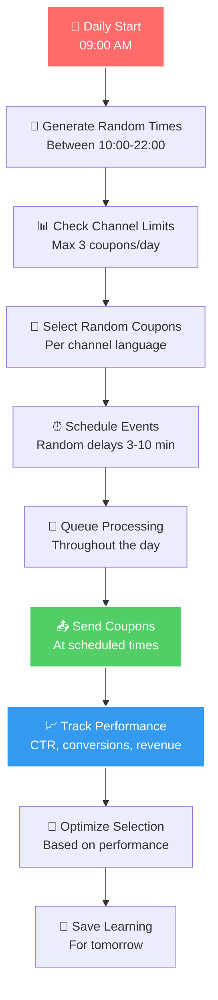

### ⏰ **Smart Timing Algorithm**
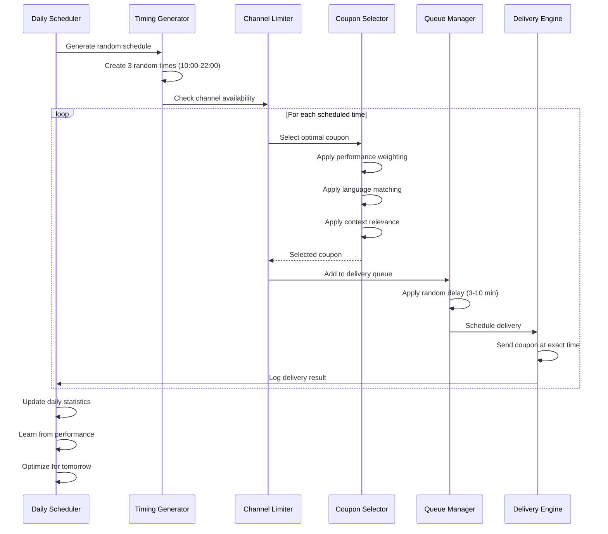

## 🌍 Multi-Language Revenue System

### 🗣️ **Language-Specific Coupon Management**
```mermaid
graph TB
    subgraph "🇮🇱 Hebrew Market"
        H1["`🎯 Israeli Sportsbooks<br/>Bet365, Winner`"]
        H2["`🎰 Casino Offers<br/>888, Betfair`"]
        H3["`🏆 Local Promotions<br/>Toto, Pais`"]
    end
    
    subgraph "🇺🇸 English Market"
        E1["`🏈 US Sportsbooks<br/>DraftKings, FanDuel`"]
        E2["`🎲 Online Casinos<br/>BetMGM, Caesars`"]
        E3["`⚽ Soccer Betting<br/>PointsBet, Barstool`"]
    end
    
    subgraph "🇪🇹 Amharic Market"
        A1["`⚽ African Sportsbooks<br/>SportyBet, Betway`"]
        A2["`🎯 Local Operators<br/>1xBet, Betwinner`"]
        A3["`🏆 Regional Offers<br/>Parimatch, Melbet`"]
    end
    
    subgraph "🇰🇪 Swahili Market"
        S1["`🏆 East African Books<br/>SportPesa, Betin`"]
        S2["`⚽ Regional Operators<br/>Odibets, Cheza`"]
        S3["`🎯 Mobile Betting<br/>Mozzart, Elitebet`"]
    end
    
    subgraph "🧠 AI Personalization"
        AI1["`🎨 Content Adaptation<br/>Native language style`"]
        AI2["`💰 Offer Localization<br/>Currency, terms`"]
        AI3["`🎯 Cultural Relevance<br/>Local preferences`"]
    end
    
    H1 --> AI1
    H2 --> AI1
    H3 --> AI1
    
    E1 --> AI2
    E2 --> AI2
    E3 --> AI2
    
    A1 --> AI3
    A2 --> AI3
    A3 --> AI3
    
    S1 --> AI1
    S2 --> AI2
    S3 --> AI3
    
    AI1 --> PD["`📤 Personalized Delivery<br/>Channel-specific content`"]
    AI2 --> PD
    AI3 --> PD
    
    style AI1 fill:#ff6b6b,stroke:#fff,stroke-width:2px,color:#fff
    style AI2 fill:#51cf66,stroke:#fff,stroke-width:2px,color:#fff
    style AI3 fill:#339af0,stroke:#fff,stroke-width:2px,color:#fff
    style PD fill:#ffd43b,stroke:#333,stroke-width:2px,color:#333
```

## 📊 Performance Analytics & Optimization

### 📈 **Real-time Revenue Tracking**
```mermaid
graph LR
    A["`📊 Coupon Delivered<br/>Impression tracked`"] --> B["`👆 User Interaction<br/>Click tracked`"]
    
    B --> C["`💰 Conversion Event<br/>Revenue generated`"]
    
    C --> D["`📈 Performance Metrics<br/>CTR, conversion rate, revenue`"]
    
    D --> E["`🧠 AI Learning<br/>Pattern recognition`"]
    
    E --> F["`🎯 Optimization<br/>Improve future selection`"]
    
    F --> G["`🔄 Continuous Learning<br/>Adaptive algorithms`"]
    
    style A fill:#ff6b6b,stroke:#fff,stroke-width:2px,color:#fff
    style C fill:#51cf66,stroke:#fff,stroke-width:2px,color:#fff
    style E fill:#339af0,stroke:#fff,stroke-width:2px,color:#fff
    style G fill:#ffd43b,stroke:#333,stroke-width:2px,color:#333
```

### 🎯 **Performance Optimization Cycle**
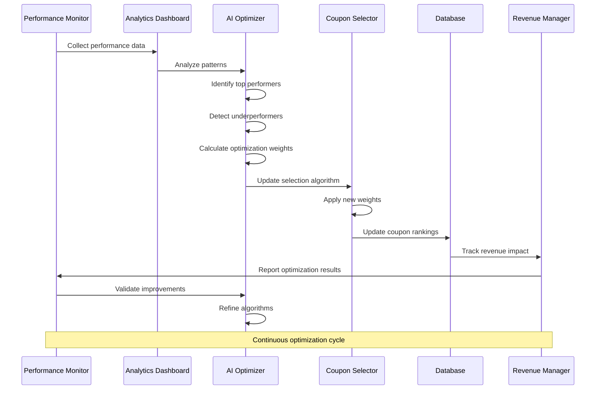

## 💎 Advanced Revenue Features

### 🎯 **Context-Aware Coupon Matching**
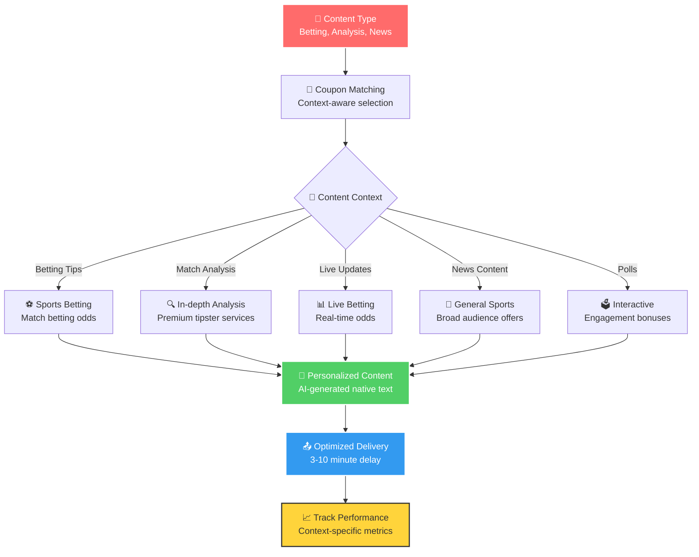

### 🚀 **Revenue Scaling Strategy**
```mermaid
graph LR
    A["`📊 Current Performance<br/>CTR, conversion, revenue`"] --> B["`🧠 AI Analysis<br/>Pattern recognition`"]
    
    B --> C["`🎯 Optimization Areas<br/>Timing, content, targeting`"]
    
    C --> D["`📈 Scaling Opportunities<br/>New markets, channels`"]
    
    D --> E["`💰 Revenue Growth<br/>Increased monetization`"]
    
    E --> F["`🌍 Global Expansion<br/>Multi-region support`"]
    
    F --> G["`🏆 Market Leadership<br/>Competitive advantage`"]
    
    style A fill:#ff6b6b,stroke:#fff,stroke-width:2px,color:#fff
    style E fill:#51cf66,stroke:#fff,stroke-width:2px,color:#fff
    style G fill:#339af0,stroke:#fff,stroke-width:2px,color:#fff
```

## 🔍 Quality Assurance & Fraud Prevention

### 🛡️ **Anti-Fraud System**
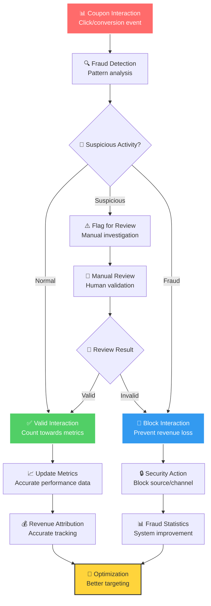

## 📋 Revenue System APIs

### 💰 **Smart Push APIs**
```typescript
// 🎯 Trigger Coupon
POST /api/smart-push/trigger
{
  "content_type": "betting",
  "channel_id": "channel_123",
  "probability": 0.8,
  "delay_minutes": 5
}

// 📅 Schedule Daily Coupons
POST /api/smart-push/schedule
{
  "channel_id": "channel_123",
  "max_daily": 3,
  "time_window": "10:00-22:00"
}

// 📊 Revenue Analytics
GET /api/smart-push/status
Response: {
  "daily_revenue": 245.67,
  "impressions": 1250,
  "clicks": 189,
  "conversions": 23,
  "ctr": 15.1,
  "conversion_rate": 12.2
}

// ⚡ Process Coupon Event
POST /api/smart-push/process
{
  "coupon_id": "coupon_123",
  "event_type": "click",
  "user_data": {...}
}
```

## 🎯 Success Metrics & KPIs

### 📊 **Key Performance Indicators**
```mermaid
graph TB
    subgraph "💰 Revenue Metrics"
        R1["`💵 Daily Revenue<br/>Target: $200+`"]
        R2["`📈 Growth Rate<br/>Target: 15% monthly`"]
        R3["`💎 Revenue Per User<br/>Target: $2.50`"]
    end
    
    subgraph "🎯 Engagement Metrics"
        E1["`👆 Click-Through Rate<br/>Target: 12%+`"]
        E2["`💰 Conversion Rate<br/>Target: 8%+`"]
        E3["`🔄 Return Rate<br/>Target: 25%+`"]
    end
    
    subgraph "🧠 AI Performance"
        A1["`🎯 Selection Accuracy<br/>Target: 85%+`"]
        A2["`⏰ Timing Optimization<br/>Target: 90%+`"]
        A3["`🌍 Language Quality<br/>Target: 95%+`"]
    end
    
    subgraph "📊 System Health"
        S1["`✅ Delivery Success<br/>Target: 98%+`"]
        S2["`⚡ Response Time<br/>Target: <3s`"]
        S3["`🛡️ Fraud Prevention<br/>Target: <1%`"]
    end
    
    R1 --> Performance["`🏆 Overall Performance<br/>Business Success`"]
    R2 --> Performance
    R3 --> Performance
    
    E1 --> Performance
    E2 --> Performance
    E3 --> Performance
    
    A1 --> Performance
    A2 --> Performance
    A3 --> Performance
    
    S1 --> Performance
    S2 --> Performance
    S3 --> Performance
    
    style Performance fill:#ff6b6b,stroke:#fff,stroke-width:2px,color:#fff
    style R1 fill:#51cf66,stroke:#fff,stroke-width:2px,color:#fff
    style E1 fill:#339af0,stroke:#fff,stroke-width:2px,color:#fff
    style A1 fill:#ffd43b,stroke:#333,stroke-width:2px,color:#333
```

## 🚀 Future Revenue Opportunities

### 🌟 **Advanced Monetization**
- **A/B Testing**: מבחני A/B לאופטימיזציה
- **Dynamic Pricing**: תמחור דינמי לקופונים
- **Subscription Model**: מודל מנויים פרימיום
- **White-label Solutions**: פתרונות עבור לקוחות עסקיים
- **API Marketplace**: מכירת גישה ל-API
- **Revenue Sharing**: שיתוף רווחים עם שותפים

### 🎯 **Market Expansion**
- **New Languages**: הרחבה לשפות נוספות
- **Regional Markets**: התאמה לשווקים אזוריים
- **Mobile Apps**: אפליקציות מוקדשות
- **Social Media**: אינטגרציה עם פלטפורמות נוספות
- **Crypto Integration**: תמיכה במטבעות דיגיטליים

## 🎯 הערות חשובות

- **מערכת הכנסות מלאה** - אוטומטית 100%
- **תמיכה מלאה ברב-לשוניות** - 4 שפות
- **אינטליגנציה מלאכותית** - אופטימיזציה מתמשכת
- **מעקב ביצועים מלא** - כל המטריקות
- **מניעת הונאות** - מערכת אבטחה מתקדמת
- **גמישות מלאה** - התאמה לכל ערוץ
- **מוכנה לפריסה מסחרית** - קוד production-ready 