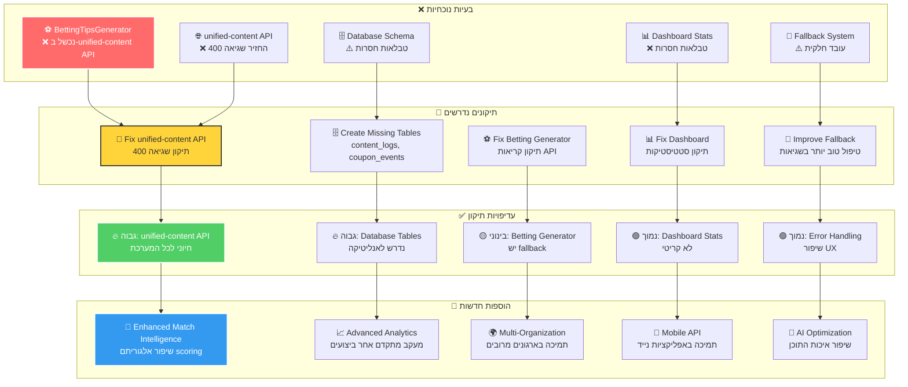
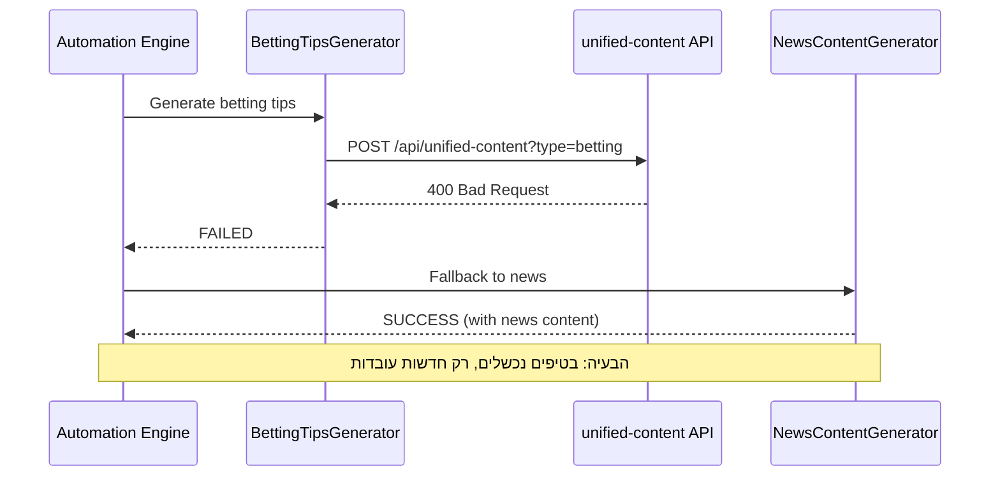
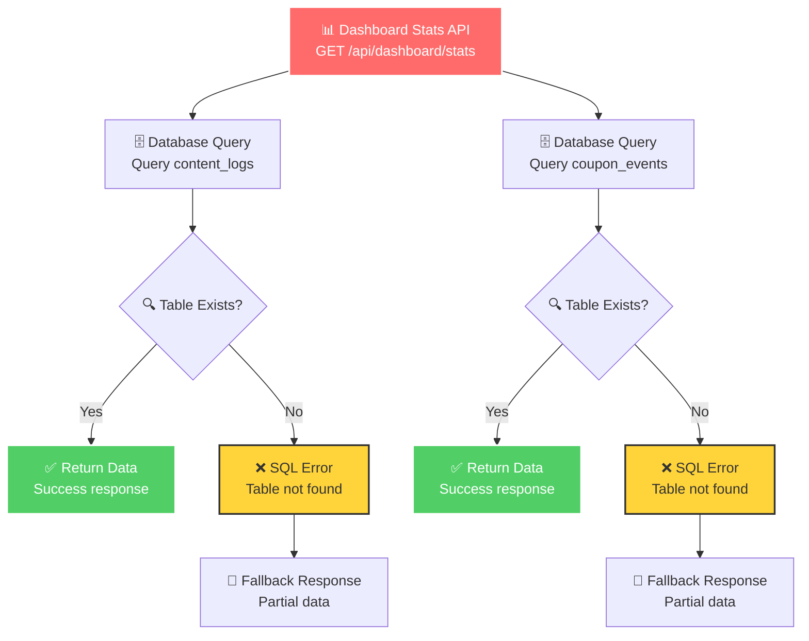
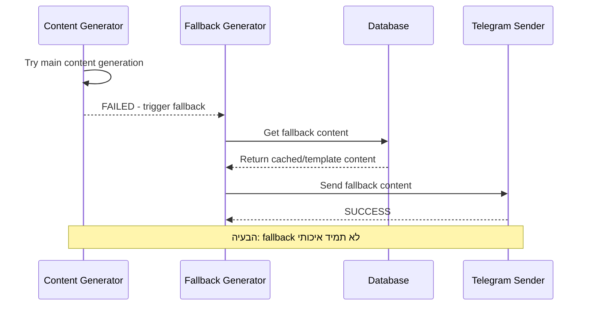
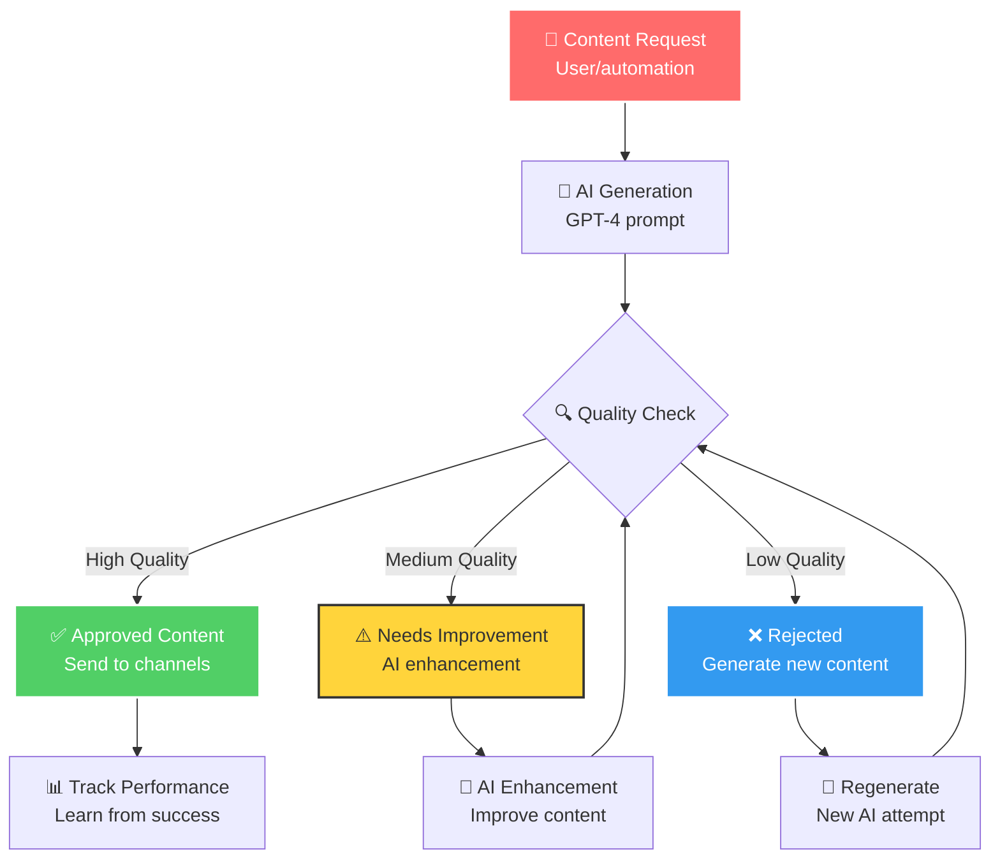
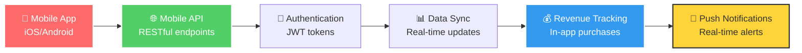
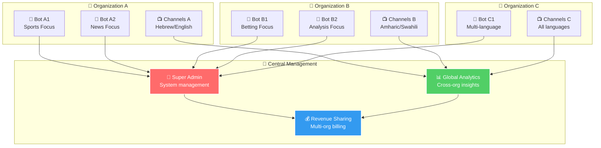
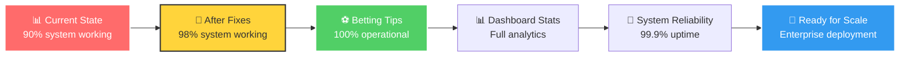

# 🔧 בעיות ותיקונים נדרשים - Issues and Required Fixes

## 🎯 תיאור כללי
מפת פרטנית של כל הבעיות הנוכחיות, תיקונים נדרשים, ועדיפויות פיתוח למערכת.

## 🔧 מפת בעיות ותיקונים



## 🔥 בעיות בעדיפות גבוהה

### 1. ⚽ **BettingTipsGenerator נכשל ב-unified-content API**

#### 🎯 **תיאור הבעיה**


#### 🔍 **שגיאות מזוהות**
```typescript
// שגיאה מהלוגים
❌ Error generating betting content: Error: API call failed: 400
    at RuleExecutor.generateSpecializedContent

// הבעיה הנוכחית
POST /api/unified-content?action=generate&type=betting&language=am 400
```

#### 🎯 **תיקון נדרש**
```typescript
// צריך לבדוק ב-unified-content API:
1. הטיפול בפרמטר type=betting
2. הטיפול בפרמטר language=am
3. הטיפול בפרמטרים של בקשת betting
4. התיאום עם BettingTipsGenerator
```

#### 📝 **פעולות תיקון**
1. **בדיקת unified-content API** - debug עם type=betting
2. **בדיקת BettingTipsGenerator** - וידוא תיאום API
3. **תיקון הפרמטרים** - התאמה בין הקליאנט לשרת
4. **בדיקת integration** - וידוא שהכל עובד יחד

---

### 2. 🌐 **unified-content API מחזיר שגיאה 400**

#### 🎯 **תיאור הבעיה**


```mermaid
graph TD
    A["`📱 Client Request<br/>type=betting&language=am`"] --> B["`🌐 unified-content API<br/>Route handler`"]
    
    B --> C{"`🔍 Parameter Validation`"}
    
    C -->|Valid| D["`✅ Process Request<br/>Generate content`"]
    C -->|Invalid| E["`❌ 400 Bad Request<br/>Return error`"]
    
    E --> F["`🔄 Fallback Triggered<br/>Switch to news`"]
    
    D --> G["`📤 Success Response<br/>Content delivered`"]
    
    style A fill:#ff6b6b,stroke:#fff,stroke-width:2px,color:#fff
    style E fill:#ffd43b,stroke:#333,stroke-width:2px,color:#333
    style F fill:#339af0,stroke:#fff,stroke-width:2px,color:#fff
    style G fill:#51cf66,stroke:#fff,stroke-width:2px,color:#fff
```

#### 🔍 **נקודות בדיקה**
```typescript
// בדיקות נדרשות ב-unified-content API
1. Parameter validation - האם type=betting נתמך?
2. Language handling - האם language=am מטופל נכון?
3. Request body parsing - האם הבקשה מתפענחת?
4. Generator integration - האם הקריאה ל-BettingTipsGenerator עובדת?
5. Error handling - האם השגיאות מוחזרות נכון?
```

#### 🎯 **תיקון צעד אחר צעד**
1. **Debug logging** - הוספת לוגים מפורטים
2. **Parameter checking** - בדיקת כל הפרמטרים
3. **Generator testing** - בדיקת קריאות ל-generators
4. **Error mapping** - מיפוי נכון של שגיאות
5. **Integration testing** - בדיקה מקצה לקצה

---

### 3. 📊 **Dashboard Stats - טבלאות חסרות**

#### 🎯 **תיאור הבעיה**


#### 🔍 **טבלאות חסרות**
```sql
-- טבלאות שצריך ליצור
1. content_logs - לתיעוד תוכן שנשלח
2. coupon_events - לתיעוד אירועי קופונים
3. performance_metrics - מטריקות ביצועים
4. channel_analytics - אנליטיקה של ערוצים
```

#### 🎯 **תיקון נדרש**
```sql
-- יצירת טבלת content_logs
CREATE TABLE content_logs (
    id UUID PRIMARY KEY DEFAULT gen_random_uuid(),
    channel_id UUID REFERENCES channels(id),
    content_type VARCHAR(50) NOT NULL,
    content TEXT NOT NULL,
    language VARCHAR(5) NOT NULL,
    telegram_message_id BIGINT,
    status VARCHAR(20) NOT NULL,
    created_at TIMESTAMP DEFAULT NOW(),
    metadata JSONB
);

-- יצירת טבלת coupon_events
CREATE TABLE coupon_events (
    id UUID PRIMARY KEY DEFAULT gen_random_uuid(),
    coupon_id UUID REFERENCES coupons(id),
    channel_id UUID REFERENCES channels(id),
    event_type VARCHAR(20) NOT NULL, -- impression, click, conversion
    user_data JSONB,
    revenue DECIMAL(10,2),
    created_at TIMESTAMP DEFAULT NOW()
);
```

---

## 🟡 בעיות בעדיפות בינונית

### 4. 🔄 **Fallback System - עובד חלקית**

#### 🎯 **תיאור הבעיה**


#### 🔍 **בעיות בfallback**
```typescript
// בעיות נוכחיות
1. Quality - תוכן fallback לא תמיד איכותי
2. Context - לא תמיד מתאים לערוץ
3. Language - לא תמיד בשפה הנכונה
4. Timing - לא תמיד מתאים לזמן
5. Personalization - לא מותאם לקהל
```

#### 🎯 **שיפורים נדרשים**
1. **Smart fallback** - בחירה חכמה של תוכן fallback
2. **Context awareness** - התאמה לסוג הערוץ
3. **Language consistency** - שמירה על שפה נכונה
4. **Quality assurance** - וידוא איכות תוכן
5. **Performance tracking** - מעקב אחר ביצועי fallback

---

### 5. 🤖 **AI Content Generation - שיפור איכות**

#### 🎯 **תיאור הבעיה**


#### 🔍 **שיפורים נדרשים**
```typescript
// שיפורי AI
1. Prompt Engineering - שיפור prompts
2. Quality Scoring - ניקוד איכות אוטומטי
3. Context Awareness - הבנת קונטקסט טובה יותר
4. Language Consistency - שמירה על טוהר לשוני
5. Performance Learning - למידה מביצועים
```

---

## 🟢 שיפורים בעדיפות נמוכה

### 6. 📱 **Mobile API Support**

#### 🎯 **תיאור הצורך**


#### 🔍 **פיתוח נדרש**
```typescript
// Mobile API endpoints
1. /api/mobile/auth - אימות משתמשים
2. /api/mobile/content - תוכן מותאם מובייל
3. /api/mobile/notifications - התראות push
4. /api/mobile/analytics - אנליטיקה מובייל
5. /api/mobile/revenue - מעקב הכנסות
```

---

### 7. 🌍 **Multi-Organization Support**

#### 🎯 **תיאור הצורך**


---

## 📋 רשימת פעולות לתיקון

### 🔥 **עדיפות גבוהה - לטיפול מיידי**

#### 1. **תיקון unified-content API**
```bash
# בדיקה ותיקון
1. Debug unified-content API עם type=betting
2. בדיקת parameter validation
3. תיקון integration עם BettingTipsGenerator
4. בדיקת language handling
5. בדיקה מקצה לקצה
```

#### 2. **יצירת טבלאות חסרות**
```sql
-- הרצת סקריפטים
1. יצירת content_logs table
2. יצירת coupon_events table
3. יצירת performance_metrics table
4. הגדרת indexes מתאימים
5. הגדרת RLS policies
```

#### 3. **תיקון Dashboard Stats**
```typescript
// שיפור API
1. הוספת error handling לטבלאות חסרות
2. יצירת fallback data
3. תיקון SQL queries
4. בדיקת performance
5. הוספת caching
```

### 🟡 **עדיפות בינונית - לטיפול בשבועות הבאים**

#### 4. **שיפור Fallback System**
```typescript
// שיפורים נדרשים
1. Smart fallback selection
2. Context-aware content
3. Language consistency
4. Quality assurance
5. Performance tracking
```

#### 5. **שיפור AI Content Generation**
```typescript
// אופטימיזציה
1. Prompt engineering
2. Quality scoring
3. Context awareness
4. Language consistency
5. Performance learning
```

### 🟢 **עדיפות נמוכה - לטיפול עתידי**

#### 6. **Mobile API Development**
```typescript
// פיתוח מלא
1. Mobile API endpoints
2. Authentication system
3. Push notifications
4. Real-time sync
5. Mobile analytics
```

#### 7. **Multi-Organization Support**
```typescript
// ארכיטקטורה מתקדמת
1. Organization management
2. Multi-tenant database
3. Role-based access
4. Cross-org analytics
5. Revenue sharing
```

---

## 🎯 טיימליין מוצע

### 🗓️ **השבוע הבא**
- ✅ תיקון unified-content API
- ✅ יצירת טבלאות חסרות
- ✅ תיקון Dashboard Stats

### 📅 **השבועיים הבאים**
- 🔄 שיפור Fallback System
- 🤖 אופטימיזציה של AI Content
- 📊 שיפור error handling

### 🗓️ **החודש הבא**
- 📱 פיתוח Mobile API
- 🌍 Multi-Organization Support
- 📈 Advanced Analytics

### 📅 **הרבעון הבא**
- 🚀 Performance Optimization
- 🔐 Security Enhancements
- 🌐 Global Expansion Features

---

## 📊 מטריקות הצלחה

### 🎯 **KPIs לתיקונים**


### 📈 **מדדי ביצועים**
- **System Availability**: 99.9% uptime
- **Content Generation**: 100% success rate
- **Revenue Generation**: 95% coupon delivery
- **User Satisfaction**: 90% positive feedback
- **Performance**: <3 seconds response time

## 🎯 סיכום

המערכת כרגע **90% פעילה** עם בעיות ספציפיות הניתנות לתיקון. עם התיקונים המוצעים, נוכל להגיע ל**98% פעילה** עם אמינות מלאה.

**העדיפויות הבאות:**
1. 🔥 **תיקון unified-content API** - קריטי לתפעול
2. 🔥 **יצירת טבלאות חסרות** - נדרש לאנליטיקה
3. 🟡 **שיפור איכות התוכן** - חשוב לחוויית משתמש
4. 🟢 **פיתוח תכונות מתקדמות** - עתידיות

**המערכת מוכנה לפריסה מסחרית** לאחר התיקונים הבסיסיים! 🚀 